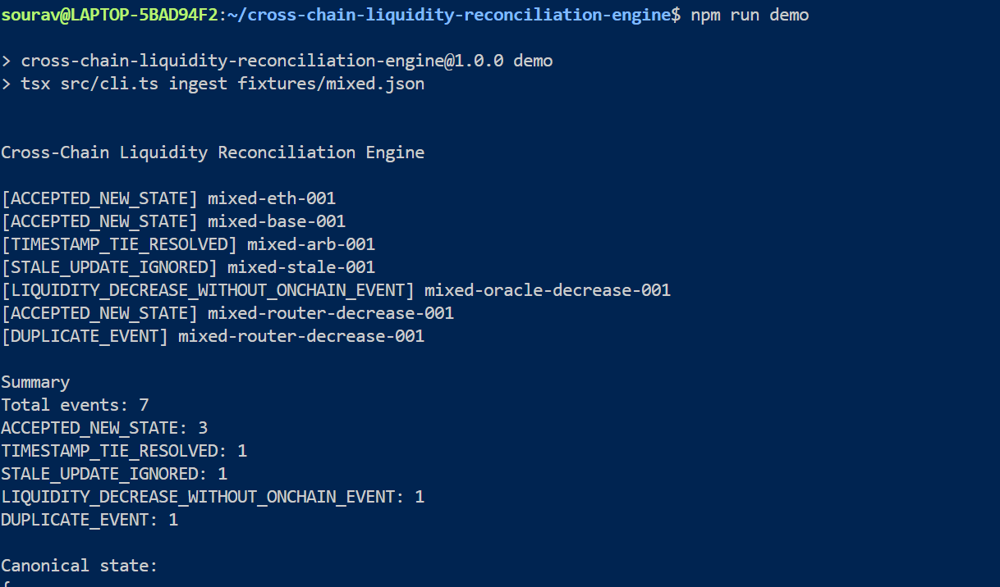
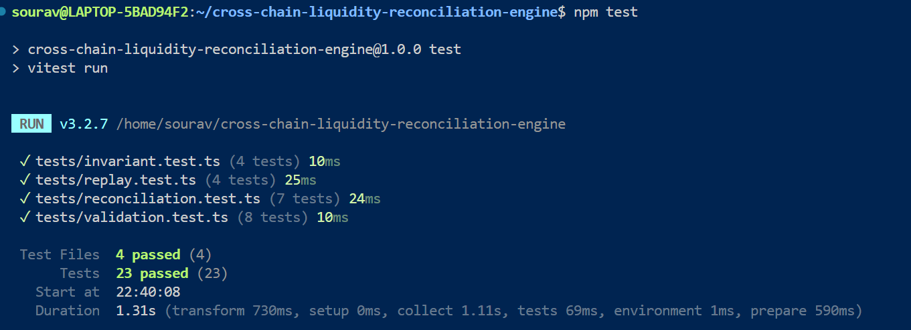
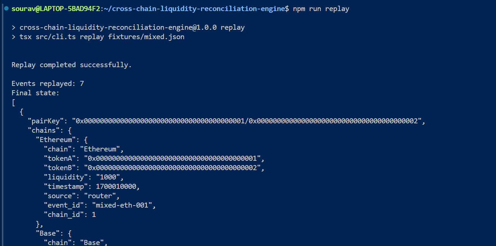
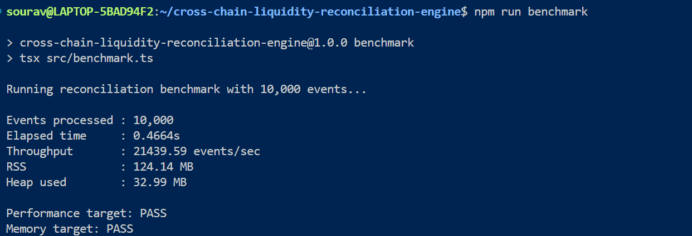

# Cross-Chain Liquidity Reconciliation Engine

> A deterministic, replayable security engine for reconciling asynchronous liquidity state across Ethereum, Base, and Arbitrum.

The engine processes liquidity events from multiple chains, handles duplicates and out-of-order updates, detects conflicting states, enforces temporal liquidity invariants, resolves conflicts deterministically, and produces an auditable reconciliation trail.

All blockchain activity is simulated locally using fixtures.

---

## What It Does

```text
Liquidity Events
       │
       ▼
Validation & Normalization
       │
       ▼
Idempotent Processing
       │
       ▼
Per-Chain State
       │
       ├── Timestamp precedence
       ├── Chain-of-trust
       └── Temporal invariant
       │
       ▼
Canonical State
       │
       ├── Audit Trail
       └── Deterministic Replay
```

### Core capabilities

- Ethereum, Base, and Arbitrum liquidity events
- Duplicate and stale event detection
- Out-of-order event handling
- Deterministic timestamp reconciliation
- Chain-of-trust resolution: `Arbitrum > Base > Ethereum`
- Temporal liquidity decrease enforcement
- JSONL audit trail
- Historical event replay
- CLI and HTTP API
- Automated tests
- Local performance benchmark

---

## Reconciliation Rules

### Timestamp precedence

For competing states, the newer timestamp takes precedence.

### Chain-of-trust

When timestamps are equal:

```text
Arbitrum > Base > Ethereum
```

### Idempotency

The same `event_id` is processed only once. Duplicate submissions do not mutate state.

### Temporal invariant

Liquidity must not decrease without corresponding on-chain evidence.

For example:

```text
Previous liquidity: 1500

Oracle reports: 1000
        ↓
Decrease without on-chain event
        ↓
State transition rejected
```

A router-backed decrease can be accepted because it provides the corresponding event evidence.

---

## Quick Start

```bash
git clone https://github.com/Sourav-IIITBPL/cross-chain-liquidity-reconciliation-engine.git
cd cross-chain-liquidity-reconciliation-engine

npm install
npm test
npm run build
```

---

## Run the Engine

Start the HTTP server:

```bash
npm start
```

Server:

```text
http://localhost:3000
```

Health check:

```bash
curl http://localhost:3000/health
```

Process an event:

```bash
curl -X POST http://localhost:3000/events \
  -H "Content-Type: application/json" \
  -d '{
    "chain": "Arbitrum",
    "tokenA": "0x0000000000000000000000000000000000000001",
    "tokenB": "0x0000000000000000000000000000000000000002",
    "liquidity": "1500000000000000000",
    "timestamp": 1700000100,
    "source": "router",
    "event_id": "arb-001",
    "chain_id": 42161
  }'
```

### HTTP endpoints

```text
GET  /health
GET  /state
GET  /audit
POST /events
POST /replay
```

---

## CLI Demo

Run the mixed edge-case scenario:

```bash
npm run demo
```

Replay the same event sequence:

```bash
npm run replay
```

The mixed fixture covers:

- Normal state updates
- Timestamp conflicts
- Chain-of-trust
- Stale updates
- Unauthorized liquidity decreases
- Legitimate decreases
- Duplicate events

---

## Screenshots

### Reconciliation Demo



Live fixture processing showing deterministic reconciliation decisions across multiple edge cases.

### Automated Tests



Automated tests covering validation, reconciliation, invariant enforcement, and deterministic replay.

### Deterministic Replay



Historical events replayed to reproduce the reconciled state.

### Performance Benchmark



Local 10,000-event benchmark with throughput and memory measurements.


---

## Testing

Run the complete test suite:

```bash
npm test
```

Build the project:

```bash
npm run build
```

The tests cover:

- Event validation
- Duplicate handling
- Timestamp ordering
- Chain-of-trust
- Temporal invariant enforcement
- State consistency
- Deterministic replay
- Replay failure handling

---

## Performance

Run:

```bash
npm run benchmark
```

The benchmark processes 10,000 local events and reports:

- Throughput
- Elapsed time
- RSS memory
- Heap usage

The benchmark is designed to verify the challenge's local performance and memory requirements.

---

## Audit Trail

Reconciliation decisions are recorded as JSONL.

```text
audit/
└── mixed-audit.jsonl
```

Each decision contains the event context, decision, reason, timestamp, and state transition information.

---

## Fixtures

```text
fixtures/
├── basic.json
├── duplicate.json
├── out-of-order.json
├── timestamp-conflict.json
├── unauthorized-decrease.json
├── legitimate-decrease.json
└── mixed.json
```

---

## Project Structure

```text
src/
├── audit.ts
├── benchmark.ts
├── cli.ts
├── fixtures.ts
├── reconciler.ts
├── replay.ts
├── server.ts
├── state.ts
├── types.ts
└── validation.ts

tests/
├── helpers.ts
├── invariant.test.ts
├── reconciliation.test.ts
├── replay.test.ts
└── validation.test.ts

fixtures/
└── *.json

audit/
└── mixed-audit.jsonl

docs/
└── screenshots/
    ├── demo.png
    ├── tests.png
    ├── replay.png
    ├── benchmark.png
```

---

## Design Principles

**Deterministic**  
Same input and configuration produce the same reconciliation result.

**Idempotent**  
Repeated processing of the same event does not mutate state.

**Replayable**  
Historical event sequences can reproduce state transitions.

**Auditable**  
Reconciliation decisions retain their reasoning and state context.

**Local-first**  
No external database, cloud service, Kafka, Kubernetes, or live blockchain RPC is required.

---

## Scope

This implementation focuses on the reconciliation and security-enforcement middleware defined by the MVP.

Blockchain interactions are simulated through deterministic local fixtures.

Possible future extensions include:

- Time-travel debugging
- Mock Chainlink Oracle integration
- Dynamic chain reliability weighting
- Richer CLI visualization
- Production persistence
- On-chain enforcement integration

